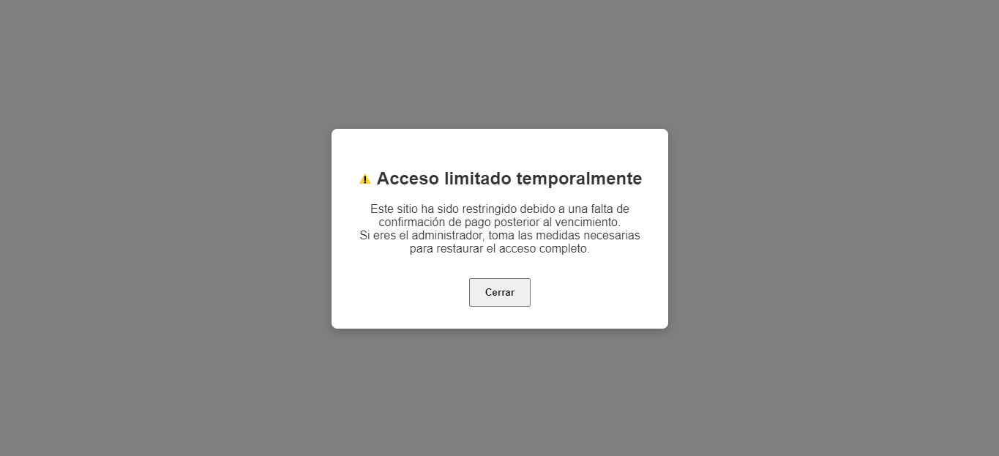

# ¿El cliente no pagó?

Este script añade opacidad a la etiqueta `<body>` de tu sitio web y reduce progresivamente su visibilidad cada día después de una fecha límite establecida. Esto hace que, si el cliente no paga, el sitio vaya desapareciendo hasta quedar completamente invisible, como una penalización visual.

---

## Cómo funciona

- Define una **fecha límite** (`due_date`), que es el día en que el pago debe estar recibido.
- Establece un **período definido** (`days_deadline`), que indica cuántos días después de la fecha límite el sitio seguirá visible, reduciendo su opacidad progresivamente.
- Después de que pase el período definido, la opacidad del cuerpo llegará a 0 y el sitio desaparecerá visualmente.

---

## Configuración

```js
/* Cambia estas variables según tus necesidades */
var due_date = new Date('2025-08-22'); // Fecha límite para el vencimiento
var days_deadline = 60; // Días después del vencimiento para que desaparezca completamente
/* Deja de cambiar aquí */
````

---

## Uso

1. Incluye el archivo JavaScript en tu página HTML o proyecto, por ejemplo:

```html
<script src="Unpaid.js"></script>
```

2. El script se ejecutará automáticamente y aplicará el efecto dependiendo de la fecha actual y la definida.

---

## Captura de pantalla



---

## Advertencia

Este script debe usarse con responsabilidad. Su objetivo es incentivar el cumplimiento de pagos, pero recuerda que bloquear o hacer invisible un sitio puede afectar la experiencia del usuario o la reputación del proyecto.

```
